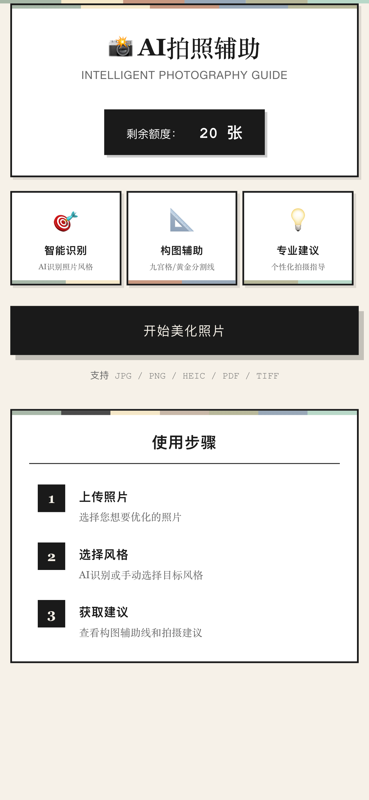
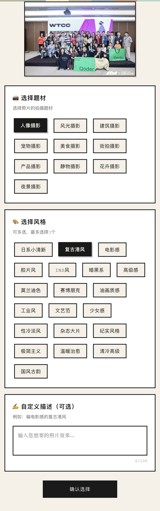
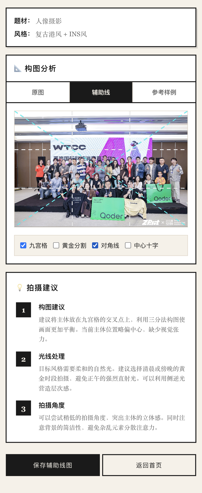

# 📸 AI拍照辅助 - 智能构图工具

> 一款面向摄影小白和社交媒体内容创作者的智能拍照辅助工具，采用复古报纸风格UI设计，提供专业构图辅助线和拍摄建议。

[](LICENSE)
[](https://www.ecma-international.org/)
[](https://www.modelscope.cn/studios/nakia9/photo_advice2)

## ✨ 功能特性

### 🎯 核心功能

- **智能风格识别** - 支持10大题材分类（人像、风光、建筑、宠物、美食等）
- **20+种风格标签** - 日系小清新、复古港风、电影感、胶片风等
- **构图辅助线** - 提供4种专业辅助线类型
  - 九宫格辅助线（三分法构图）
  - 黄金分割线（0.618比例）
  - 对角线辅助
  - 中心十字线
- **智能适配** - 线条粗细根据图片尺寸自动调整（8-40px）
- **专业建议** - 针对构图、光线、角度提供个性化指导
- **图片下载** - 支持导出带辅助线的图片

### 🎨 UI设计

- **复古报纸风格** - 独特的视觉设计，多色调装饰条
- **响应式布局** - 完美适配移动端和桌面端
- **微信小程序兼容** - 优化WebView环境体验

## 🚀 在线演示

- **ModelScope Studio**: [https://www.modelscope.cn/studios/nakia9/photo_advice2](https://www.modelscope.cn/studios/nakia9/photo_advice2)
- **GitHub Pages**: [https://natsukou.github.io/photo_edit](https://natsukou.github.io/photo_edit) *(即将上线)*

## 📸 界面展示

### 首页 - 复古报纸风格


*展示剩余额度、三大功能特色和开始按钮*

### 风格选择页


*支持10种题材分类和20+种风格标签*

### 构图辅助线效果


*提供九宫格、黄金分割、对角线、中心十字4种辅助线*

### 拍摄建议


*AI生成个性化的构图、光线和角度建议*

> **注**: 截图请查看 [screenshots](screenshots/) 目录。如需更新截图，请参考该目录下的说明文档。

## 💻 技术栈

### 前端技术
- **HTML5 + CSS3 + JavaScript (ES6+)** - 纯原生开发，无框架依赖
- **Canvas API** - 高性能图像处理和辅助线绘制
- **SPA架构** - 自研路由系统，流畅的单页应用体验
- **LocalStorage** - 本地状态管理和额度系统

### 部署方案
- **Docker + Nginx** - 容器化部署，端口7860
- **ModelScope Studio** - 云端托管平台

## 📂 项目结构

```
photo_edit/
├── index.html              # 应用入口
├── css/                    # 样式文件
│   ├── global.css         # 全局样式
│   ├── index.css          # 首页样式
│   ├── upload.css         # 上传页样式
│   ├── style-select.css   # 风格选择页样式
│   └── result.css         # 结果页样式
├── js/                     # JavaScript文件
│   ├── app.js             # 应用核心逻辑
│   ├── router.js          # 路由系统
│   ├── utils.js           # 工具函数库
│   ├── alicloud.js        # API封装
│   ├── sample-images.js   # 示例数据
│   └── pages/             # 页面逻辑
│       ├── index.js       # 首页
│       ├── upload.js      # 上传页
│       ├── style-select.js # 风格选择页
│       └── result.js      # 结果页
├── images/                 # 静态资源
├── Dockerfile             # Docker配置
├── docker-compose.yml     # 容器编排
└── package.json           # 项目配置
```

## 🛠️ 本地开发

### 环境要求
- Node.js (可选，用于开发服务器)
- Python 3.x (可选，用于简单HTTP服务)
- Docker (可选，用于容器化部署)

### 快速开始

#### 方法一：使用 Python
```bash
# 克隆项目
git clone https://github.com/natsukou/photo_edit.git
cd photo_edit

# 启动服务器
python3 -m http.server 8080

# 访问 http://localhost:8080
```

#### 方法二：使用 Node.js
```bash
# 安装依赖
npm install

# 启动开发服务器
npm run dev

# 访问 http://localhost:8080
```

#### 方法三：使用 Docker
```bash
# 构建镜像
docker build -t photo-edit .

# 运行容器
docker run -p 7860:7860 photo-edit

# 访问 http://localhost:7860
```

## 🎯 核心功能说明

### 1. 构图辅助线绘制

使用 Canvas API 实现动态辅助线绘制：

- **智能线宽**: 根据图片尺寸自适应调整（最小8px，最大40px）
- **虚线样式**: 大间隔虚线设计，清晰不干扰
- **多种颜色**: 
  - 九宫格 - 白色 (#FFFFFF)
  - 黄金分割 - 金黄色 (#FFD700)
  - 对角线 - 青色 (#00FFFF)
  - 中心十字 - 洋红色 (#FF00FF)

### 2. 微信小程序兼容

针对微信WebView环境特别优化：

- **事件兼容**: 使用 addEventListener 替代 onclick
- **触摸支持**: 同时绑定 click 和 touchend 事件
- **下载优化**: 微信环境下长按保存，避免闪退

### 3. 响应式设计

- 金刚区一行3列布局，自适应屏幕宽度
- 文字超长自动省略，防止换行
- 完美支持 iPhone、Android 各种尺寸

## 📊 性能优化

- **纯原生开发**: 无框架依赖，打包体积小
- **Canvas优化**: 支持6000px+超高清图片流畅处理
- **懒加载**: 按需加载页面资源
- **本地缓存**: LocalStorage缓存用户数据

## 🔧 关键技术实现

### 自定义路由系统
```javascript
// 基于 hash 路由实现的 SPA
Router.navigate('result');  // 页面跳转
Router.reLaunch('index');   // 清空历史栈跳转
```

### Canvas 辅助线动态绘制
```javascript
// 根据图片尺寸自适应线宽
const baseLineWidth = Math.max(8, Math.min(w, h) / 150);
ctx.lineWidth = baseLineWidth;
ctx.setLineDash([lineWidth * 5, lineWidth * 4]);
```

### 微信环境检测
```javascript
const isWeChat = /micromessenger/i.test(navigator.userAgent);
// 针对不同环境采用不同的下载策略
```

## 📝 待扩展功能

- [ ] 接入真实AI识别API
- [ ] 更多辅助线类型（螺旋构图、三角构图等）
- [ ] 用户账号系统
- [ ] 社交分享功能
- [ ] 拍摄教程库
- [ ] 批量处理功能

## 🚀 GitHub Pages 部署

本项目支持通过 GitHub Pages 进行在线演示，启用步骤：

1. 访问 [Settings > Pages](https://github.com/natsukou/photo_edit/settings/pages)
2. Source 选择 `Deploy from a branch`
3. 分支选择 `master`，目录选择 `/ (root)`
4. 点击 "Save"
5. 等待 1-5 分钟后访问: https://natsukou.github.io/photo_edit

📝 详细部署说明请查看 [.github-pages.md](.github-pages.md)

## 🤝 贡献指南

欢迎提交 Issue 和 Pull Request！

## 📄 开源协议

本项目采用 [Apache License 2.0](LICENSE) 协议开源。

## 👨‍💻 作者

- GitHub: [@natsukou](https://github.com/natsukou)
- ModelScope: [nakia9](https://www.modelscope.cn/studios/nakia9/photo_advice2)

## 🙏 致谢

感谢所有为这个项目提供建议和反馈的用户！

---

⭐ 如果这个项目对你有帮助，欢迎给个 Star！
